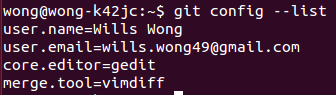
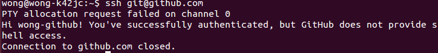

#Git与Github的配置过程

OS：Ubuntu 14.04

参考：[Git链接到自己的Github（1）简单的开始](http://www.cnblogs.com/plinx/archive/2013/04/08/3009159.html)和[Git与Github入门资料](http://www.yangzhiping.com/tech/git.html)

##Git的安装和配置
 - 安装Git：$ sudo apt-get git
 - Git的配置：
  - $ git config --global user.name "Wills Wong"     //设置用户名为Wills Wong
  - $ git config --global user.mail wills.wong49@gmail.com    //设置用户邮箱为wills.wong49@gmail.com
  - $ git config --global core.editor gedit    //设置git的默认文本编辑器为gedit
  - $ git config --global merge.tool vimdiff    //设置差异分析工具为vimdiff
 - 查看Git的配置：$ git config --list    //如下图所示即配置成功

  

##Git与Github关联
 - 往Github中添加SSH Key：
  - $ ssh-keygen -t rsa -C "wills.wong49@gmail.com"    //生成密钥
  - 用VI编辑器打开密钥文本：vi /home/linx/.ssh/id_rsa.pub，并复制密钥，然后登陆Github，往Setting - SSH Key选项下添加该密钥
  - 连接检验：$ ssh git@github.com   //如下图所示即与Github连接成功

  

##将Github上的仓库克隆到本地
 - $ git clone git@github.com:wong-github/OMOOC2py.git

   //用上面的clone命令所得到的本地仓库可以支持git push命令；还有一种形式的clone命令：$ git clone git://github.com/wong-github/OMOOC2py.git，该命令的协议不支持push，这点需要注意

##首次推送
 - $ cd OMOOC2py    //进入推送目录（OMOOC2py是之前clone的仓库，直接使用该仓库作为推送目录）
 - $ git init    //设置该目录为推送目录
 - $ touch README    //本地生成README文件
 - $ git add README    //加入修改列表
 - $ git commit -m 'first commit'    //提交修改
 - $ git remote add origin git@github.com:wong-github/OMOOC2py.git    //将远程仓库更名为origin
 - $ git push origin master    //推送此次修改到远程仓库的主分支

   推送成功后将看到自己Github下的OMOOC2py仓库中增加了README文件。

##日常推送
 - $ cd OMOOC2py     //进入推送目录
 - $ git add .    //将推送目录下的所有文件都添加进修改列表，注意“add”与“.”之间要有一个空格
 - $ git commit -a -m "fileName"    //提交fileName文件的修改
 - $ git push origin
