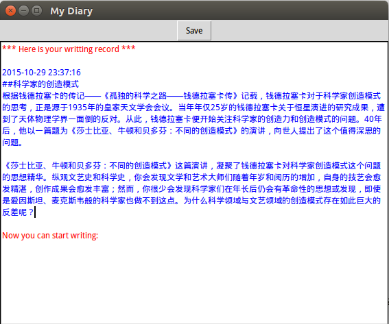
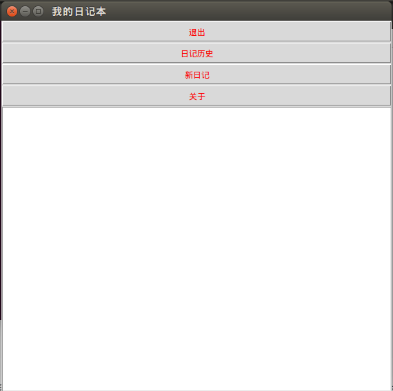
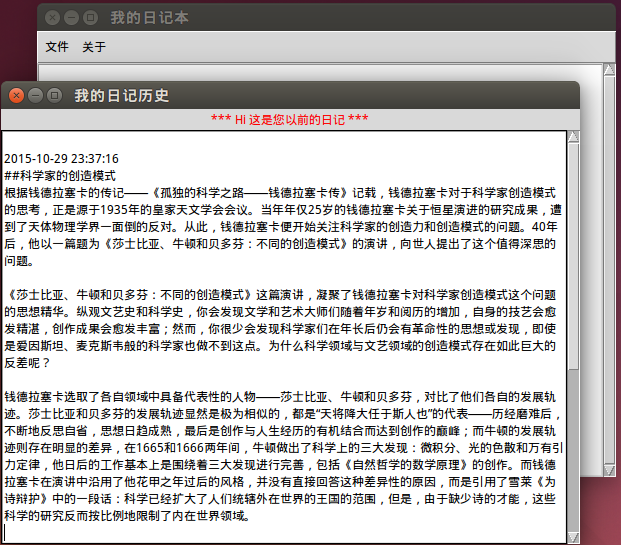

#极简交互式日记系统（桌面版）编程记录
##目录
+ [需求](#xuqiu)
+ [关键点](#guanjiandian)
+ [Version 1.0](#1.0)
+ [Version 2.0](#2.0)
+ [Version 3.0](#3.0)
+ [待完善的地方](#wanshan)
+ [所用到的主要知识点](#zhishidian)

##需求
+ 每次运行时合理的打印出过往的所有日记
+ 一次接收输入一行日记
+ 保存为本地文件

##关键点
+ tkinter，前端设计（控件、布局、相应函数），友好性

##Version 1.0
+ 代码

        # -*- coding: utf-8 -*-
        #!/usr/bin/env python

        _author_ = 'Wills Wong'

        """
        ------------------------Version 1.0-------------------------
        此脚本是桌面版极简交互式日记系统的原始版本，能实现基本功能。用户
        在运行该脚本后，能窗口中输入日记内容，并保存为本地文件。同时，对
        于非首次使用用户，脚本运行后还能在窗口中输出所有历史日记内容。
        """

        #全局引用
        from Tkinter import *
        import os,sys

        def main():
            
            #全局变量
            local = ''

            #加载sys后，setdefaultencoding方法会被删除，所以需要重新加载
            #（reload）sys才能调用setdefaultencoding方法，重新设置系统编码
            reload(sys)
            sys.setdefaultencoding( "utf-8" )

            #初始化Tk，并设置窗口标题为“My Diary”
            root = Tk()
            root.title('My Diary')

            #定义按键“Save”的事件处理函数：点击按键后保存所输入的全部内容
            def saveText():
                with open('/home/wong/test.txt','a') as f:
                    f.write(test.get(local,END))

            #创建一个Text控件和Button控件
            test = Text(root)
            buttons = Button(root, text = 'Save', command = saveText)

            #创建两个关于颜色的文本属性tag，红色用于系统提示语，蓝色用于历史日志输出
            test.tag_config('red',foreground = 'red')
            test.tag_config('blue',foreground = 'blue')

            #首次输入检测，否则打印历史日志
            if os.path.exists('/home/wong/test.txt') == True:
                test.insert(1.0,'*** Here is your writting record ***\n','red')
                with open('/home/wong/test.txt','r') as f:
                    test.insert(CURRENT, f.read() + '\n', 'blue')

            test.insert(CURRENT, 'Now you can start writing:', 'red')

            #获取新内容的起始光标位置
            local = test.index(CURRENT)

            #将buttons和test加入到root并布局，最后进入消息循环
            buttons.pack()
            test.pack()
            root.mainloop()

        #自检区，判断脚本直接被运行 or 作为模块调用
        if __name__ == '__main__':
            main()

+ 运行效果图

  

+ 概述

  Version 1.0只使用了Text和Button控件，暂时没有考虑界面布局问题，仅能实现功能上的需求。其历史日记的检测与打印方法跟Week1中的相同，当软件开始运行时，历史日记便会打印到文本区内，用户可在提示与语下方开始输入日记。

+ 关于文件保存到本地的问题

  在用户开始输入新日记前，系统会获取当前的光标位置并保存在local变量中。当用户写完日记并按“Save”按键后，系统将保存从local位置到END位置的文本内容。

+ 关于中文字符保存问题

  代码开头的语句“# -*- coding: utf-8 -*-”只能将代码的字符同意转换为UTF-8编码格式，这样能保证python解释器在解释代码时不报错。但如果用户在输入文本的时候有中文字符，那样保存的时候就会产生字符编码方面的错误。因此需要添加一下两行代码来解决这一问题：

        reload(sys)
        sys.setdefaultencoding( "utf-8" )

##Version 2.0
+ 代码

        # -*- coding: utf-8 -*-
        #!/usr/bin/env python

        _author_ = 'Wills Wong'

        """
        ------------------------Version 2.0-------------------------
        该版本在1.0的基础上，增加了功能按键，通过不同的功能按键实现相应
        的功能需求
        """

        #全局引用
        from Tkinter import *
        import os,sys,time,tkMessageBox

        def main():
            
            #全局变量
            local = ''
            filePath = '/home/wong/test.txt'

            #加载sys后，setdefaultencoding方法会被删除，所以需要重新加载
            #（reload）sys才能调用setdefaultencoding方法，重新设置系统编码
            reload(sys)
            sys.setdefaultencoding( "utf-8" )

            #初始化Tk，并设置窗口标题为“我的日记本”
            root = Tk()
            root.title('我的日记本')

            #创建Text控件
            test = Text(root)
            
            #创建两个关于颜色的文本属性tag，红色用于系统提示语，蓝色用于历史日志输出
            test.tag_config('red',foreground = 'red')
            test.tag_config('blue',foreground = 'blue')

            #定义按键“退出”的事件处理函数
            def quit():
                with open(filePath,'a') as f:
                    f.write('\n' + time.strftime('%Y-%m-%d %H:%M:%S',time.localtime(time.time())) + '\n' + test.get(local,END))
                root.destroy()

            #定义按键“日记历史”的时间处理函数
            def history():
                if os.path.exists(filePath) == True:
                    with open(filePath,'r') as f:
                        testshow = '*** Hi 这是您以前的日记 ***\n' + f.read()
                    tl = Toplevel()
                    tl.title('您的日记历史')
                    test_tl = Text(tl)
                    test_tl.insert(1.0,testshow)
                    test_tl.pack()
                else:
                    tkMessageBox.showinfo('Error','Sorry，您还没有写过日记呢！赶紧行动起来吧！')

            #定义按键“新日记”的事件处理函数
            def new():
                test.delete(1.0,END)
                test.insert(CURRENT, '现在您可以开始写新日记啦', 'red')
            
            #定义按键“关于”的事件处理函数
            def about():
                tkMessageBox.showinfo('关于该软件的信息','Author: Wills Wong\nVersion: 2.0')
            
            #创建Button控件
            Button(root, text = '退出', relief = GROOVE, fg = 'red', command = quit).pack(fill=X)
            Button(root, text = '日记历史', relief = GROOVE, fg = 'red', command = history).pack(fill=X)
            Button(root, text = '新日记', relief = GROOVE, fg = 'red', command = new).pack(fill=X)
            Button(root, text = '关于', relief = GROOVE, fg = 'red', command = about).pack(fill=X)

            #获取新内容的起始光标位置
            local = test.index(CURRENT)

            #将test加入到布局，最后进入消息循环
            test.pack()
            root.mainloop()

        #自检区，判断脚本直接被运行 or 作为模块调用
        if __name__ == '__main__':
            main()

+ 运行效果图

  

+ 概述

  在Version 1.0的基础上，Version 2.0全部通过Button来执行功能需求，并提供4种功能：新建日记、历史日记、退出和软件信息显示。其中历史日记改为在新窗口中显示，而对于新用户点击该功能按键，也会有消息提示框弹出。再加上退出自动保存的功能，能在一定程度上修复Version 1.0中保存内容错误的bug。但是，该版本仍没有解决布局问题。

##Version 3.0
+ 代码

        # -*- coding: utf-8 -*-
        #!/usr/bin/env python

        _author_ = 'Wills Wong'

        """
        ---------------------------------------Version 3.0------------------------------------------
        该版本在2.0的基础上进行修改,将2.0版本中的按键控制改为下拉菜单控制,同时加入垂直滚动条,并优化了界面
        """

        #全局引用
        from Tkinter import *
        import os,sys,time,tkMessageBox

        def main():
            
            #全局变量
            local = ''
            filePath = 'd:/test.txt'

            #加载sys后，setdefaultencoding方法会被删除，所以需要重新加载
            #（reload）sys才能调用setdefaultencoding方法，重新设置系统编码
            reload(sys)
            sys.setdefaultencoding( "utf-8" )

            #初始化Tk，并设置窗口标题为“我的日记本”
            root = Tk()
            root.title('我的日记本')

            #创建Text控件，Scrollbar控件以及带下拉菜单的Menu控件
            test = Text(root)

            menubar = Menu(root)
            fmenu = Menu(menubar,tearoff = 0)
            amenu = Menu(menubar,tearoff = 0)

            slr = Scrollbar(root)

            #将Text与Scrollbar的位置变化关联起来
            test.config(yscrollcommand = slr.set)
            slr.config(command = test.yview)

            #定义按键“新日记”的事件处理函数
            def new():
                root.title('正在编辑新日记')
                test.delete(1.0,END)

            #定义按键“退出”的事件处理函数
            def quit():
                #“退出”按键按下时，自动保存输入内容，同时添加文本保存时间
                with open(filePath,'a') as f:
                    f.write('\n' + time.strftime('%Y-%m-%d %H:%M:%S',time.localtime(time.time())) + '\n' + test.get(local,END))
                root.destroy()

            #定义按键“日记历史”的时间处理函数
            def history():
                #首次输入检测
                if os.path.exists(filePath) == True:
                    with open(filePath,'r') as f:
                        testshow = f.read()
                    #在新窗口中显示日记历史内容，Text和Scrollbar控件的实例化与配置跟主窗口的类似
                    tl = Toplevel()
                    tl.title('我的日记历史')
                    Label(tl, text = '*** Hi 这是您以前的日记 ***', fg = 'red').pack(side = TOP, fill = X)
                    test_tl = Text(tl)
                    slr_tl = Scrollbar(tl)
                    test_tl.config(yscrollcommand = slr_tl.set)
                    slr_tl.config(command = test_tl.yview)
                    test_tl.insert(1.0,testshow)
                    test_tl.pack(side = LEFT, fill = Y)
                    slr_tl.pack(side = LEFT, fill = Y)
                else:
                    #首次使用软件的用户没有日记历史文件，按下该按键会弹出提示窗口
                    tkMessageBox.showinfo('Error','Sorry，您还没有写过日记呢！赶紧行动起来吧！')
            
            #定义按键“关于”的事件处理函数
            def about():
                #显示软件信息
                tkMessageBox.showinfo('关于该软件的信息','Author: Wills Wong\nVersion: 2.0')

            #定义菜单栏的主菜单及相应的下拉菜单   
            menubar.add_cascade(label = '文件', menu = fmenu)
            menubar.add_cascade(label = '关于', menu = amenu)
            fmenu.add_command(label = '新日记', command = new)
            fmenu.add_command(label = '日记历史', command = history)
            fmenu.add_command(label = '退出', command = quit)
            amenu.add_command(label = '软件信息', command = about)
               
            #获取新内容的起始光标位置
            local = test.index(CURRENT)

            #将Text，Scrollbar和Menu加入到布局，最后进入消息循环
            test.pack(side = LEFT, fill = Y)
            slr.pack(side = RIGHT, fill = Y)
            root['menu'] = menubar
            root.mainloop()

        #自检区，判断脚本直接被运行 or 作为模块调用
        if __name__ == '__main__':
            main()

+ 运行效果图

  

+ 概述

  考虑到Text和Button同时存在时，在tkinter下布局比较麻烦，所以在Version 2.0的基础上，Version 3.0改用Menu控件来实现功能需求，共设置了两个主菜单“文件”和“关于”，“文件”主菜单下包含3个下拉子菜单“新日记”、“历史日记”和“退出”，而“关于”主菜单下包含1个下拉子菜单“软件信息”。同时在主窗口和“历史日记”窗口中加入了垂直滚动条。

+ 关于滚动条slider位置与文本Y方向显示位置的关联问题

  当滚动条slider被拖动而产生位置变化时，Text中的所显示的文本内容也要随之更新；反之亦然。因此，滚动条slider位置与文本Y方向显示位置需要关联起来。Version 3.0中通过以下代码能实现该功能：

        test.config(yscrollcommand = slr.set)
        slr.config(command = test.yview)

##待完善地方
+ 软件并不是一行行地保存用户输入的内容，而是一次性保存。这与需求有点出入。当时还没想到比较好的解决方法，后来看了一些小伙伴的代码，发现用Entry控件可以实现一行行输入和保存，同时还能将界面做的更简洁美观，这点将在网络版中改进。
+ 历史日记依然是一次性输出，这个坑暂时没有太好的想法（曾有抓取保存时间并建立索引的想法，但还没来得及深入），未来继续填……
+ 代码主要是以面向过程的形式编写，未来还可以尝试用面向对象的形式编写

##所用到的主要知识点
+ tkinter的常用控件及其属性：Text、Button、Menu、Scrollbar、Toplevel
+ sys的reload以及setdefaultencoding方法
+ 滚动条slider位置与文本Y方向显示位置的联动变化

