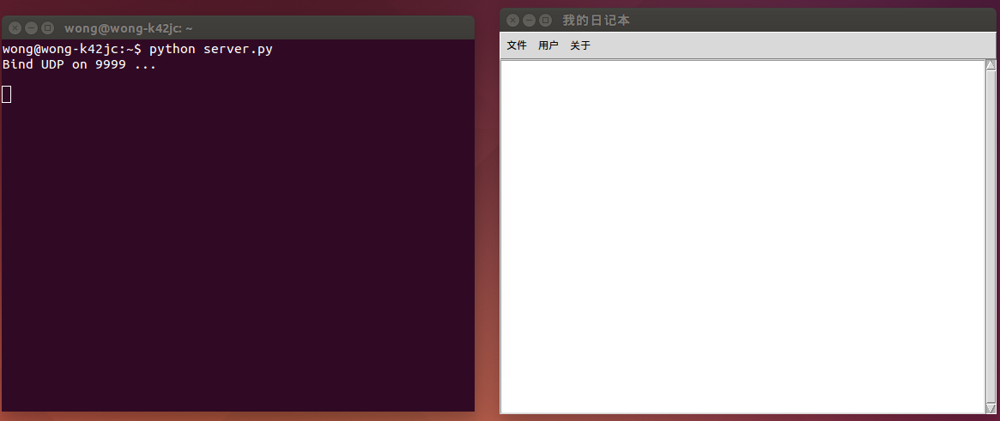

#极简交互式日记系统（网络版）编程记录
##目录
+ [需求](#xuqiu)
+ [关键点](#guanjiandian)
+ [Version 1.0](#1.0)
+ [待完善的地方](#wanshan)
+ [所用到的主要知识点](#zhishidian)

##需求<span id = "xuqiu"></span>
+ 每次运行时合理的打印出过往的所有日记
+ 一次接收输入一行日记
+ 在服务端保存为文件
+ 在所有访问的客户端可以获得历史笔记
+ 支持多个客户端同时进行笔记记录

##关键点<span id = "guanjiandian"></span>
+ 网络通信协议（TCP/UDP）在Python上的实现，实现可运行的C/S架构系统，客户端和服务器之间文件的访问、存储与传输，简单的多客户端并发提交

##Version 1.0<span id = "1.0"></span>
+ 服务器端代码

```python
    # -*- coding: utf-8 -*-
    #!/usr/bin/env python

    _author_ = 'Wills Wong'

    """
    ----------------Version 1.0--------------------
    极简交互式笔记（网络版）服务器端
    """

    #全局引用
    import os,sys,time,threading,socket

    def main():

        def choose(data, addr):
            if data == '-*-saveContent-*-':
                uname, addr = s.recvfrom(2048)
                newContent, addr = s.recvfrom(2048)
                savepath = '/home/wong/slog/' + uname + '/server_diary.txt'
                with open(savepath, 'a') as f:
                    f.write('\n' + newContent)
                print 'File was saved successfully @ %s,%s' %(addr)

            if data == '-*-historyContent-*-':
                usr_name, addr = s.recvfrom(2048)
                findpath = '/home/wong/slog/' + usr_name + '/server_diary.txt'
                if os.path.exists(findpath) == True:
                    s.sendto('T', addr)
                    with open(findpath, 'r') as f:
                        s.sendto(f.read(), addr)
                    print 'History was sent successfully @ %s,%s' %(addr)
                else:
                    s.sendto('F', addr)
            
            if data == '-*-signup-*-':
                sinup_username, addr = s.recvfrom(2048)
                signup_dirs = '/home/wong/slog/' + sinup_username
                if os.path.exists(signup_dirs) == True:
                    s.sendto('F', addr)
                    print 'Signup failed! @ %s,%s' %(addr)
                else:
                    s.sendto('T', addr)
                    signup_passwd, addr = s.recvfrom(2048)
                    os.makedirs(signup_dirs)
                    signup_filePath = signup_dirs + '/Password.txt'
                    with open(signup_filePath, 'w') as f:
                        f.write(signup_passwd)
                    print 'Signup successfully! @ %s,%s' %(addr)

            if data == '-*-login-*-':
                login_username, addr = s.recvfrom(2048)
                login_passwd, addr = s.recvfrom(2048)
                login_dirs = '/home/wong/slog/' + login_username
                login_filePath = login_dirs + '/Password.txt'
                if os.path.exists(login_dirs) == False:
                    s.sendto('N', addr)
                    print 'User does not exists! @ %s,%s' %(addr)
                else:
                    with open(login_filePath, 'r') as f:
                        passwd_test = f.read()
                    if login_passwd != passwd_test:
                        s.sendto('F', addr)
                        print 'Password error! @ %s,%s' %(addr)
                    else:
                        s.sendto('T', addr)
                        print 'Login successfully! @ %s,%s' %(addr)
                

        s = socket.socket(socket.AF_INET, socket.SOCK_DGRAM)
        s.bind(('127.0.0.1',9999))
        print 'Bind UDP on 9999 ...\n'

        while True:
            data, addr = s.recvfrom(2048)

            t = threading.Thread(target = choose ,args = (data, addr))
            t.start()
            t.join()

    #自检区，判断脚本直接被运行 or 作为模块调用
    if __name__ == '__main__':
        main()

```

+ 客户端代码

```python
    # -*- coding: utf-8 -*-
    #!/usr/bin/env python

    _author_ = 'Wills Wong'

    """
    --------------Version 1.0-------------------
    极简交互式笔记（网络版）客户端，能运行多客户端
    """

    #全局引用
    from Tkinter import *
    import os,sys,time,tkMessageBox,socket

    def main():
        
        #全局变量
        local = ''

        #加载sys后，setdefaultencoding方法会被删除，所以需要重新加载
        #（reload）sys才能调用setdefaultencoding方法，重新设置系统编码
        reload(sys)
        sys.setdefaultencoding( "utf-8" )

        #初始化Tk，并设置窗口标题为“我的日记本”
        root = Tk()
        root.title('我的日记本')

        #创建Text控件，Scrollbar控件以及带下拉菜单的Menu控件
        test = Text(root)

        menubar = Menu(root)
        fmenu = Menu(menubar,tearoff = 0)
        umenu = Menu(menubar,tearoff = 0)
        amenu = Menu(menubar,tearoff = 0)

        slr = Scrollbar(root)

        #将Text与Scrollbar的位置变化关联起来
        test.config(yscrollcommand = slr.set)
        slr.config(command = test.yview)

        #定义按键“新日记”的事件处理函数
        def new():
            root.title('正在编辑新日记')
            test.delete(1.0,END)

        #定义按键“保存并上传”的时间处理函数
        def save_upload():
            if os.path.exists('/home/wong/clog/username_temp.txt') == True:
                #读取用户的新日记内容并添加时间信息
                savelog = time.strftime('%Y-%m-%d %H:%M:%S',time.localtime(time.time())) + '\n' + test.get(local,END)
                #文件保存到本地
                with open('/home/wong/clog/local_diary.txt','a') as f:
                    f.write('\n' + savelog)
                #读取用户的登陆信息
                with open('/home/wong/clog/username_temp.txt','r') as f:
                    uname = f.read()      
                #将用户的新日记上传到服务器端进行保存
                s = socket.socket(socket.AF_INET, socket.SOCK_DGRAM)
                s.sendto('-*-saveContent-*-',('127.0.0.1',9999))
                s.sendto(uname,('127.0.0.1',9999))
                s.sendto(savelog,('127.0.0.1',9999))
                s.close
            else:
                tkMessageBox.showinfo('Error','您目前还没登陆，请登陆！')

        #定义按键“退出”的事件处理函数
        def quit():
            #删除用于记录用户登陆信息的本地临时文件
            if os.path.exists('/home/wong/clog/username_temp.txt') == True:
                os.remove(r'/home/wong/clog/username_temp.txt')
            #主窗口关闭，程序运行结束
            root.destroy()

        #定义按键“日记历史”的时间处理函数
        def history():
            if os.path.exists('/home/wong/clog/username_temp.txt') == True:
                #读取用户的登陆信息
                with open('/home/wong/clog/username_temp.txt','r') as f:
                    usr_name = f.read()
                s = socket.socket(socket.AF_INET, socket.SOCK_DGRAM)
                s.sendto('-*-historyContent-*-', ('127.0.0.1',9999))
                s.sendto(usr_name, ('127.0.0.1',9999))
                flag, addr = s.recvfrom(2048) 
                #首次使用检测     
                if flag == 'T':
                    #接收服务器发送过来的日记历史
                    testshow, addr = s.recvfrom(2048)
                    #在新窗口中显示日记历史内容，Text和Scrollbar控件的实例化与配置跟主窗口的类似
                    tl = Toplevel()
                    tl.title('我的日记历史')
                    Label(tl, text = '*** Hi 这是您以前的日记 ***', fg = 'red').pack(side = TOP, fill = X)
                    test_tl = Text(tl)
                    slr_tl = Scrollbar(tl)
                    test_tl.config(yscrollcommand = slr_tl.set)
                    slr_tl.config(command = test_tl.yview)
                    test_tl.insert(1.0,testshow)
                    test_tl.pack(side = LEFT, fill = Y)
                    slr_tl.pack(side = LEFT, fill = Y)
                if flag == 'F':
                    #首次使用软件的用户没有日记历史文件，按下该按键会弹出提示窗口
                    tkMessageBox.showinfo('Error','Sorry，您还没有写过日记呢！赶紧行动起来吧！')
                s.close
            else:
                tkMessageBox.showinfo('Error','您目前还没登陆，历史日记需要登陆才能查看，请登陆！')
        
        #定义按键“关于”的事件处理函数
        def about():
            #显示软件信息
            tkMessageBox.showinfo('关于该软件的信息','Author: Wills Wong\nVersion: 2.0')

        #定义按键“登陆...”的时间处理函数
        def login():
            tl = Toplevel(root)
            tl.title('登陆')

            Label(tl, text = '请在下方文本框内输入用户名', fg = 'red').pack(fill = X)
            eu = Entry(tl)
            eu.pack()
            eu.focus_set()

            Label(tl, text = '请在下方文本框内输入密码', fg = 'red').pack(fill = X)
            en = Entry(tl)
            en.pack()
            en.focus_set()
            en['show'] ='*'

            def blogin():
                s = socket.socket(socket.AF_INET, socket.SOCK_DGRAM)
                s.sendto('-*-login-*-',('127.0.0.1',9999))
                s.sendto(eu.get(),('127.0.0.1',9999))
                s.sendto(en.get(),('127.0.0.1',9999))
                login_ok, addr = s.recvfrom(2048)
                if login_ok == 'T':
                    tkMessageBox.showinfo('Successful!','登陆成功，现在开始您的日记之旅吧')
                    root.title(eu.get() + '的日记本')
                    #登陆成功后，将登陆信息保存到本地临时文件，程序正常退出时自动删除该文件
                    with open('/home/wong/clog/username_temp.txt','w') as f:
                        f.write(eu.get())
                if login_ok == 'F':
                    tkMessageBox.showinfo('Error!','您输入的密码错误，请重新输入')
                    en.delete(0, END)
                if login_ok == 'N':
                    tkMessageBox.showinfo('Error!','您还没注册，请先进行注册')
                s.close
      
            Button(tl, text = '登陆', command = blogin).pack()

        #定义按键“新用户注册...”的事件处理函数
        def signup():
            tl = Toplevel(root)
            tl.title('新用户注册')

            Label(tl, text = '请在下方文本框内输入用户名', fg = 'red').pack(fill = X)
            eu = Entry(tl)
            eu.pack()
            eu.focus_set()

            Label(tl, text = '请在下方文本框内输入密码', fg = 'red').pack(fill = X)
            en = Entry(tl)
            en.pack()
            en.focus_set()
            en['show'] ='*'

            Label(tl, text = '请再次出入密码', fg = 'red').pack(fill = X)
            enb = Entry(tl)
            enb.pack()
            enb.focus_set()
            enb['show'] ='*' 
              
            def bsignup():
                if en.get() != enb.get():
                    tkMessageBox.showinfo('Error!','您输入的密码不正确，请重新输入')
                    en.delete(0, END)
                    enb.delete(0, END)
                else:
                    s = socket.socket(socket.AF_INET, socket.SOCK_DGRAM)
                    s.sendto('-*-signup-*-',('127.0.0.1',9999))
                    s.sendto(eu.get(),('127.0.0.1',9999))
                    signup_ok, addr = s.recvfrom(2048)
                    if signup_ok == 'T':
                        s.sendto(en.get(),('127.0.0.1',9999))
                        tkMessageBox.showinfo('Successful!','您已成功注册，可以登陆并开始您的日记之旅')
                    if signup_ok == 'F':
                        tkMessageBox.showinfo('Error!','用户名已存在，请重新输入注册信息')
                        eu.delete(0, END)
                        en.delete(0, END)
                        enb.delete(0, END)               
                    s.close

            Button(tl, text = '注册', command = bsignup).pack()      

        #定义菜单栏的主菜单及相应的下拉菜单   
        menubar.add_cascade(label = '文件', menu = fmenu)
        menubar.add_cascade(label = '用户', menu = umenu)
        menubar.add_cascade(label = '关于', menu = amenu)
        fmenu.add_command(label = '新日记', command = new)
        fmenu.add_command(label = '日记历史', command = history)
        fmenu.add_command(label = '保存并上传', command = save_upload)
        fmenu.add_command(label = '退出', command = quit)
        umenu.add_command(label = '登陆...', command = login)
        umenu.add_command(label = '新用户注册...', command = signup)
        amenu.add_command(label = '软件信息', command = about)
           
        #获取新内容的起始光标位置
        local = test.index(CURRENT)

        #将Text，Scrollbar和Menu加入到布局，最后进入消息循环
        test.pack(side = LEFT, fill = Y)
        slr.pack(side = RIGHT, fill = Y)
        root['menu'] = menubar
        root.mainloop()

    #自检区，判断脚本直接被运行 or 作为模块调用
    if __name__ == '__main__':
        main()

```

+ 运行效果图

  

+ 概述

  该系统用服务器和客户端组成。用户在客户端注册并登陆后，即可软件中进行新日记编辑，同时可以随时查看存储于服务器上的日记历史，还可以将自己的新日记同步到服务器上并备份到本地客户端。 

+ 关于网络通信协议

  python支持通过TCP和UDP协议实现服务器与客户端的通信，在其内置的socket模块中已包含了网络通信常用的方法，编程时直接调用即可。由于UDP的实现相对简单，因此该软件选择使用UDP协议。

+ 简单的多客户端并发提交

  在基于UDP协议进行通信这一背景下，若服务器只能单线程处理多客户端的并发提交，则会影响提交的处理速度，甚至可能无法响应客户端的提交。因此，该软件的服务器采用多线程的方式处理同时提交的问题。服务器在接收到客户端的指令后都会开一个新线程来处理（如下面代码所示），这样就能简单地处理多客户端的并发提交问题。

```python
    while True:
        data, addr = s.recvfrom(2048)

        t = threading.Thread(target = choose ,args = (data, addr))
        t.start()
        t.join()

```

+ 关于不同用户在同一客户端获取其服务器上的日记历史

  参考一些网络笔记软件的实现方式，该软件通过用户登陆信息解决这一问题。在服务器端，用户的所有日记均被保存在以其用户名命名的文件夹下。因此在文件传输前，只需先传输用户信息（主要是用户名），服务器便可自动查找该用户的日记历史内容。即使是多用户使用同一客户端，也可通过上述方法获取到其日记历史。同时，这一方法也解决了同一客户在不同客户端获取日记历史的问题。

##待完善地方<span id = "wanshan"></span>
+ 软件并不是一行行地保存用户输入的内容，而是一次性保存。这与需求有点出入。虽然方法已知道，但由于改动太大，影响到主要需求的实现进度，所以暂未完成。
+ 历史日记依然是一次性输出，这个坑暂时没有太好的想法，未来继续填……
+ 服务器与客户端之间关于用户信息的传输还有待改善（现时的方法虽然实现了需求，但存在不少bug，比如安全性方面）

##所用到的主要知识点<span id = "zhishidian"></span>
+ python中的UDP通信，socket模块
+ 多线程，threading模块

