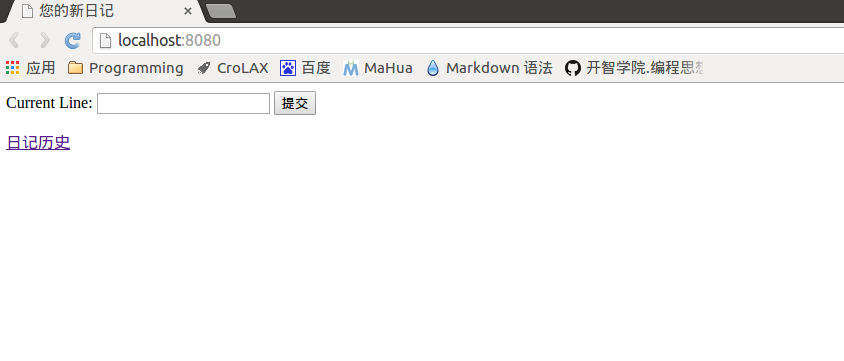
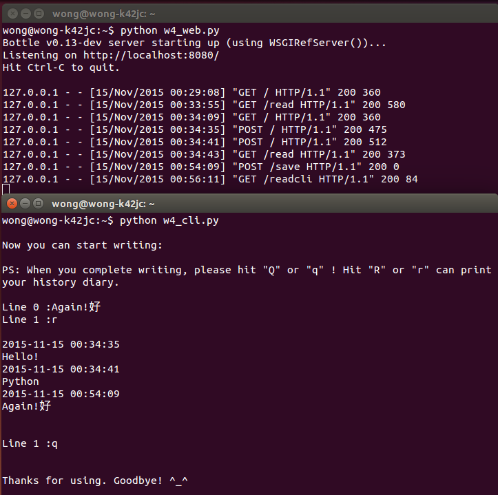

#极简交互式日记系统（web版）编程记录
##目录
+ [需求](#xuqiu)
+ [关键点](#guanjiandian)
+ [Version 1.0](#1.0)
+ [所用到的主要知识点](#zhishidian)

##需求<span id = "xuqiu"></span>
+ 通过网页访问系统
+ 每次运行时合理的打印出过往的所有笔记
+ 一次接收输入一行笔记
+ 在服务端保存为文件
+ 同时兼容 3w 的 Net 版本的命令行界面进行交互


##关键点<span id = "guanjiandian"></span>
+ python的web框架（bottle），实现可运行的B/S架构系统，命令行与服务器的交互

##Version 1.0<span id = "1.0"></span>
+ 服务器端代码

```python
    # -*- coding: utf-8 -*-
    #!/usr/bin/env python

    _author_ = 'Wills Wong'

    '''
    --------------------------------Version 1.0-------------------------------------
    极简交互式笔记（web版），支持浏览器访问，同时兼容 3w 的 Net 版本的命令行界面进行交互
    '''

    from bottle import *
    import os,time

    def main():

        savePath = '/home/wong/slog/diary.txt'
        tempPath = '/home/wong/slog/temp.txt' 

        #用浏览器访问http://localhost:8080/read,在浏览器端输出历史日记内容
        @route('/read')
        def read():
            if os.path.exists(tempPath) == True:
                os.remove(r'/home/wong/slog/temp.txt')
            if os.path.exists(savePath) == True:      
                with open(savePath,'r') as f:
                    return '''
                    <html>
                    <head>
                    <title>您的日记历史</title>
                    </head>
                    <body>
                    <a href = "http://localhost:8080/">新日记</a>
                    <p> %s </p>
                    </body>
                    </html>
                    ''' % (f.read()).replace('\n', '<br />')
            else:
                return '''<p>啊哈～您还没写过日记哦！赶紧动手把</p>'''

        #用浏览器访问http://localhost:8080，在浏览器端可进行新日记编辑和提交
        @route('/', method = 'GET')
        def input_one_line():
            return '''
            <html>
            <head>
            <title>您的新日记</title>
            </head>
            <body>
            <form method="POST" action="/">
            Current Line:
            <input name="content" type="text" />
            <input type="submit" />
            </form>
            <a href = "http://localhost:8080/read">日记历史</a>
            </body>
            </html>
            '''

        @route('/', method='POST')
        def submit_one_line():
            saveLine = time.strftime('%Y-%m-%d %H:%M:%S',time.localtime(time.time())) + '\n' + request.forms.get('content') + '\n'
            with open(savePath, 'a') as f:
                f.write(saveLine)
            with open(tempPath, 'a') as f:
                f.write(saveLine)
            with open(tempPath, 'r') as f:
                return '''
                <html>
                <head>
                <title>您的新日记</title>
                </head>
                <body>
                <form method="POST" action="/">
                Current Line:
                <input name="content" type="text" />
                <input type="submit" />
                </form>
                <a href = "http://localhost:8080/read">日记历史</a>
                <p> %s </p>
                </body>
                </html>
                ''' % (f.read()).replace('\n', '<br />')

        #保存命令行界面提交的新日记信息
        @route('/save', method = 'POST')
        def save():
            saveLine = time.strftime('%Y-%m-%d %H:%M:%S',time.localtime(time.time())) + '\n' + request.POST.get('newline') + '\n'
            with open(savePath, 'a') as f:
                f.write(saveLine)

        #向命令行界面打印历史日记信息
        @route('/readcli')
        def readcli():
            if os.path.exists(savePath) == True:      
                with open(savePath,'r') as f:
                    return '%s' % f.read()
            else:
                return '啊哈～您还没写过日记哦！赶紧动手把'


        run(host='localhost',port=8080,debug=True)

    #自检区，判断脚本直接被运行 or 作为模块调用
    if __name__ == '__main__':
        main()

```

+ 命令行代码

```python
    # -*- coding: utf-8 -*-
    #!/usr/bin/env python

    _author_ = 'Wills Wong'

    '''
    ----------Version 1.0-------------------
    极简交互式笔记（web版）的命令行界面进行交互
    '''

    import os,requests

    def main():
         
        print '\nNow you can start writing:\n'
        print 'PS: When you complete writing, please hit "Q" or "q" ! Hit "R" or "r" can print your history diary.\n'

        line = 0
        saveurl = 'http://localhost:8080/save'
        readurl = 'http://localhost:8080/readcli'

        while True:
            try:        
                line_num = 'Line %d :' % line
                a = raw_input(line_num)
                if a == 'Q' or a == 'q':		
                    print '\n\nThanks for using. Goodbye! ^_^\n'
                    break
                if a == 'R' or a == 'r': 
                    s = requests.get(readurl)
                    print '\n' + s.text +'\n'
                    line -= 1
                else: 
                    requests.post(saveurl, data = {'newline':a})
                 
                line += 1
            except KeyboardInterrupt:
                print '\n\nError! You can not hit "Ctrl-C" when you writing, it will interupt input and the current line will lose!\n'
                break

    #自检区，判断脚本直接被运行 or 作为模块调用
    if __name__ == '__main__':
        main()

```

+ 运行效果图

  浏览器访问：

  

  命令行访问：

  

+ 概述

  启动浏览器后，用户可通过浏览器或者命令行进行交互，实现新日记的编辑和历史日记的查看。 

+ 关于命令行交互中信息的提交与获取

  其实实现方法有很多，之前也看到不少同学用pycurl、liburl之类的方法实现。本程序中使用requests模块来实现命令行与服务器之间信息的传输。在命令行交互过程中，通过requests.post（）方法将用户输入内容提交到服务器并保存，通过requests.get()方法将日记历史传送到命令行端并显示。感觉上这样能比较简单地实现命令行与服务器之间的通信。

##所用到的主要知识点<span id = "zhishidian"></span>
+ python中的轻量级web架构：Bottle架构
+ requests模块
+ HTML的基本语法

