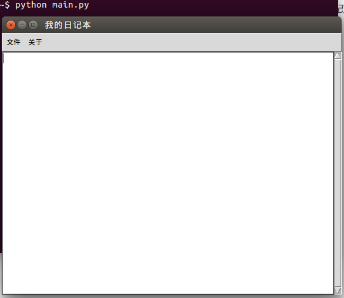
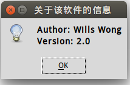
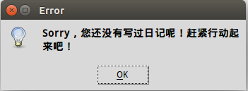
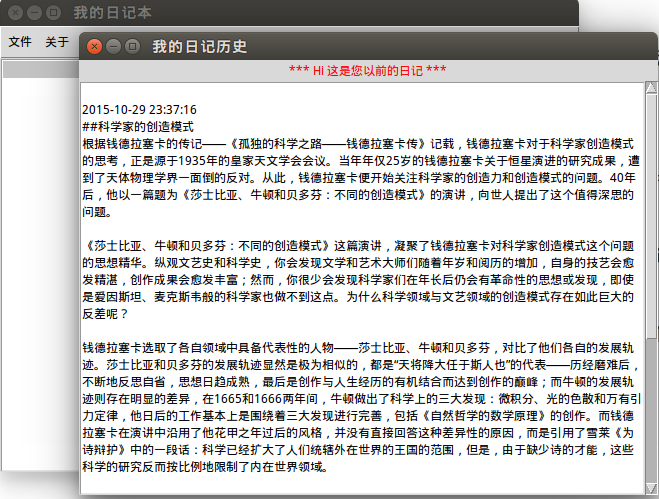
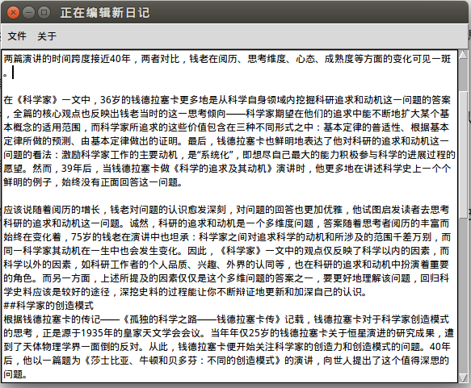

#极简交互式日记系统（桌面版）使用说明

_PS：演示系统：Ubuntu 14.04 （Windows系统下也可以使用该软件，但需要修改源码中的filePath变量，即历史日记文件的保存路径）_

1. 在Linux系统下，打开Terminal，运行脚本，可见如下图所示的初始界面。在标题为“我的日记本”的窗口里，包含了两个主菜单——“文件”和“关于”，同时下方有一个空白的文本输入区和滚动条。

  

2. 点击主菜单中的“关于”，会显示名为“软件信息”的下拉菜单。点击该下拉菜单，会弹出一个名为“关于该软件的信息”的消息提示框。如下图所示。

  

3. 点击主菜单中的“文件”，会显示出其包含的三个下拉菜单：“新日记”、“日记历史”和“退出”。

4. 下拉菜单中的“日记历史”，用于显示用户过往所写的日记。若用户是首次使用该软件，由于其没有历史日记，所以此时点击该下拉菜单会弹出如下图所示的消息提示框。

  

   若用户已经使用过该软件进行日记写作，则点击“日记历史”下拉菜单，软件会弹出名为“我的日记历史”的新窗口，并在该窗口中显示用户的日记历史记录。如下图所示。

  

5. 点击下拉菜单中的“新日记”，软件将会进入如下图所示的新日记编辑模式，用户可在图中的文本输入区进行新日记的写作。

  

6. 点击下拉菜单中的“退出”，当前文本区所输入的内容将自动保存，然后软件将关闭。

_by 黄贤斌_

_2015-10-30_

