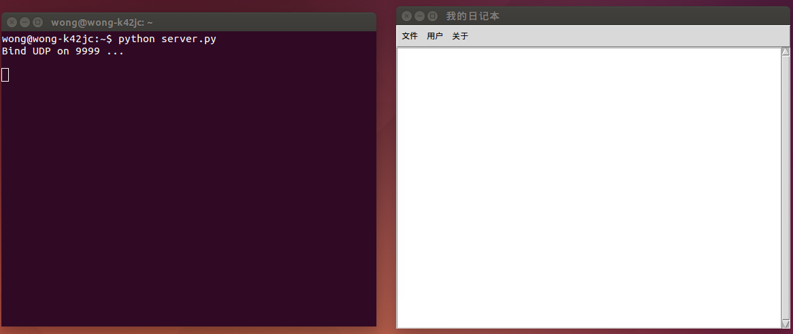
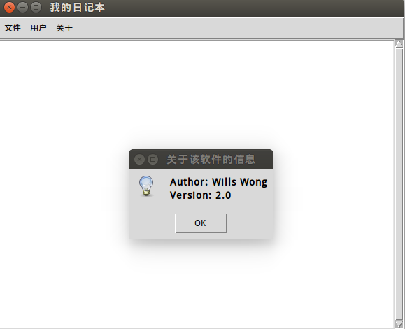
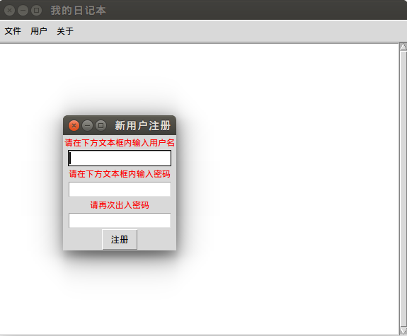
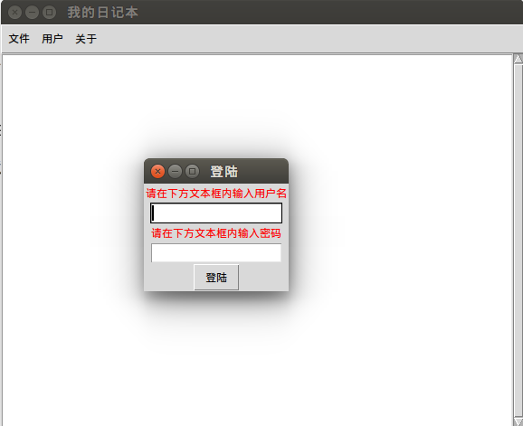
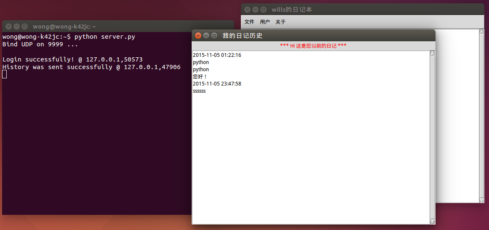
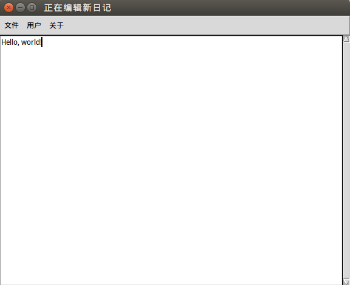

#极简交互式日记系统（网络版）使用说明

_PS：演示系统：Ubuntu 14.04 （Windows系统下也可以使用该软件，但需要修改源代码中的所有访问路径）_

1. 该系统由服务器端和客户端组成。服务器端以_命令行_的形式显示，客户端以_桌面版_的形式显示。

2. 在Ubuntu 14.04下，打开Terminal，先运行服务器脚本文件，再运行客户端脚本。可见如下图所示的初始界面。其中客户端有三项主菜单：文件、用户和关于。

  

3. 点击主菜单中的“关于”，可见其下有一个下拉菜单“软件信息”。点击该下拉菜单会弹出如下图所示的关于软件信息的消息提醒框。

  

4. 点击主菜单中的“用户”，可见其下有两个下拉菜单：“登陆...”和“新用户注册...”。

5. 点击“新用户注册...”，系统会弹出如下图所示的新用户注册窗口，用户按照要求依次输入用户名和密码，通过服务器端的检测后便可注册成功。若出现两次输入密码不同以及用户名同名错误，系统均会弹出相应的错误信息提示框，同时用户需要重新输入注册信息。

  

6. 点击“登陆...”，系统会弹出如下图所示的登陆窗口。用户在每次使用系统前必须进行登陆，否则无法查看到位于服务器的日记历史，同时也无法上传新日记。如果输入的用户名或者密码有误，系统也会弹出相应的错误信息提示框。

  

7. 点击主菜单中的“文件”，可见其下有四个下拉菜单：“新日记”、“日记历史”、“保存并上传”和“退出”

8. 用户登陆后，点击“日记历史”后会弹出日记历史窗口，并显示存储于服务器端的日记历史，同时服务器端也会有相应的信息显示。如下图所示。如果是新用户或未登陆用户，点击“日记历史”后会弹出相应的错误信息提示框。

  

9. 点击“新日记”，用户可以在如图所示的文本区域内编辑日记内容。

  

10. 用户完成新日记内容编辑后，点击“保存并上传”，可将新日记同步到服务器并备份在客户端。同时，如果用户没有登陆，点击该菜单后系统将报错，服务器端也会有相应提示。

11. 点击“退出”，用户可以安全地退出该系统。

