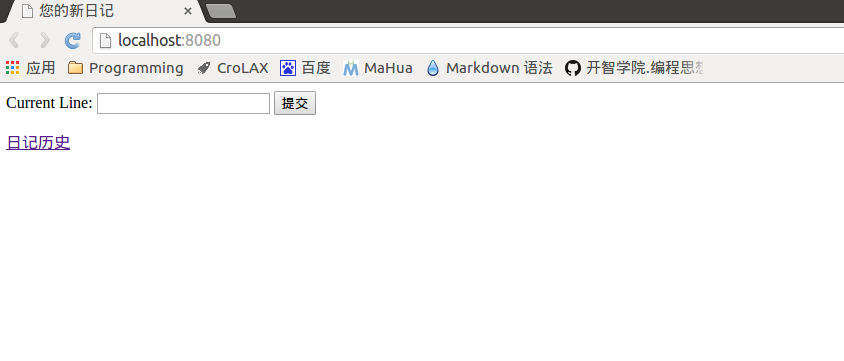
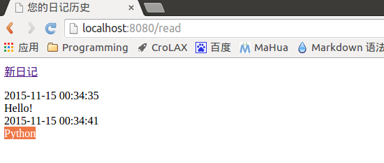
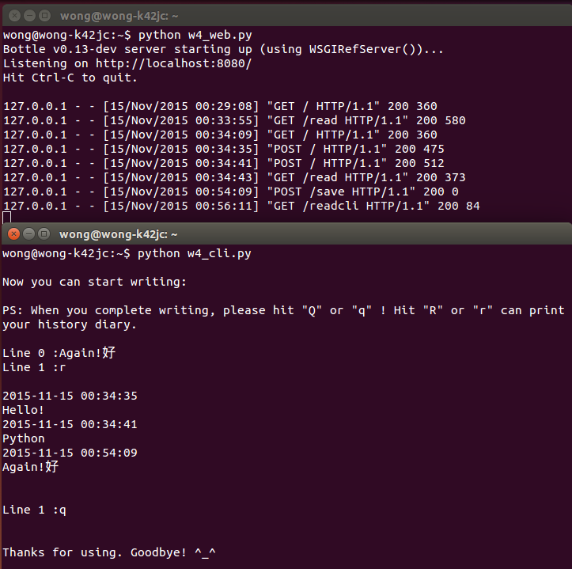

#极简交互式日记系统（web版）使用说明

_演示系统：Ubuntu 14.04_

1. 运行服务器端后，用户可通过浏览器或者命令行使用该软件

2. 在Ubuntu 14.04下，打开Terminal，先运行服务器脚本文件（w4_web.py）

3. 打开浏览器，在地址栏中输入http://localhost:8080，可见如图所示的操作界面

    

4. 在“Current Line”文本框中，可以输入一行新日记，按“提交”按键后，文本框中的内容会提交到服务器并自动保存

5. 点击“日记历史”，浏览器会跳转到如图所示的历史日记显示页面，用户可以阅读过往的日记。点击“新日记”，浏览器会跳转回之前的新日记编辑页面。

    

6. 保持服务器运行，再打开新的Terminal，运行客户端脚本文件（w4_cli.py）。用户可以一行一行地输入日记内容，输入Q或q，然后回车，可退出命令行；输入R或r，然后回车，可显示历史输入内容。

    

