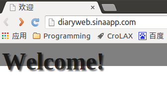
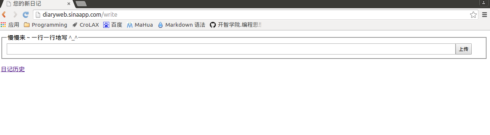
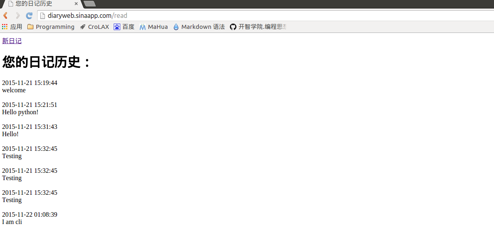

#极简交互式日记系统（PaaS版）使用说明

_演示系统：Ubuntu 14.04_

1. 运行服务器端后，用户可通过浏览器或者命令行使用该软件

2. 打开浏览器，在地址栏中输入http://diaryweb.sinaapp.com，可见如图所示的欢迎页面

    

3. 欢迎页面显示两秒后会自动跳转到如图所示的新日记编辑页面，用户在输入框中每输入完一行日记内容后点击“上传”按键，所输入的内容便会自动保存到服务器端

    

4. 点击“日记历史”，浏览器会跳转到如图所示的历史日记显示页面，用户可以阅读过往的日记。点击“新日记”，浏览器会跳转回之前的新日记编辑页面。

    

